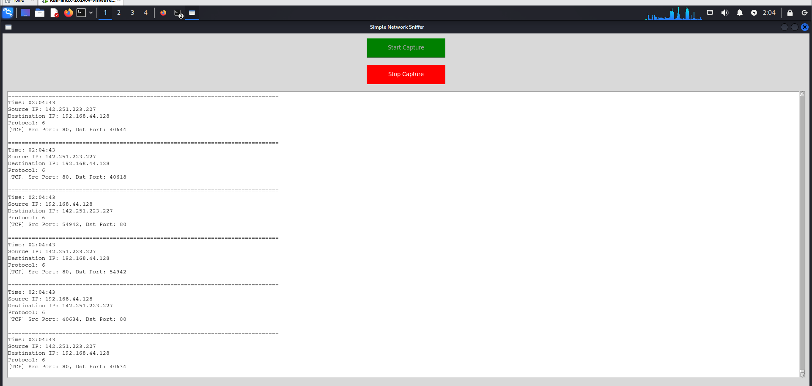

# CodeAlpha_Project_Packet_Sniffer

# Python Network Packet Sniffer with GUI

A simple network packet sniffer built in Python using Scapy and Tkinter.  
It captures live network traffic and displays source/destination IPs, protocol info, ports, and payload preview in real time with start/stop capture controls.

## Features

- Real-time packet capture and display
- Start and stop capture buttons
- Shows IP addresses, protocols (TCP/UDP), ports, and payload data
- Scrollable GUI output window with packet count

## Requirements

- Python 3.x
- Scapy (`pip install scapy`)
- Tkinter (usually pre-installed with Python)
- Administrative privileges (root or sudo) to capture packets

## Installation

1. Clone the repository:
   ```bash
   git clone https://github.com/imranhussain404/CodeAlpha_Project_Packet_Sniffer.git
   cd CodeAlpha_Project_Packet_Sniffer/NetworkSnifferProject/


2. Usage

Run the program with sudo:

```bash
sudo python3 simple_gui_sniffer.py

## Screenshot



